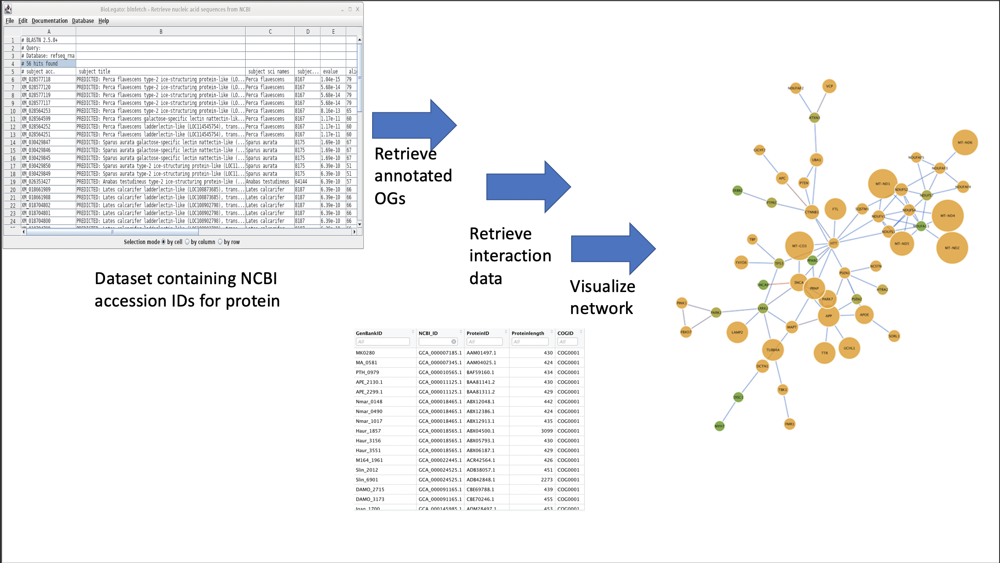

# Description

The MicroMetaGraph R package, when given a set of input dataset of protein IDs from the GenBank database, will construct an interaction network using orthology data, functional annotations and PPI data from various metatranscriptomic databases. When analyzing microbial communities or any environment where PPI are a crucial factor, oftentimes there will be proteins present with an unknown function or that belongs to a species that has not yet been sequenced. Therefore, interaction networks including these unknown proteins aid in the interpretation of the protein's role could be, and have been very popular in metatranscriptomic workflows in the past. While there have been R packages that are able to return interaction data about an input protein and construct interaction networks in the past, there is not one that has incorpoorated the structure of orthologous groups. Thus, with the MicroMetaGraph package, viewing interaction networks in the context of orthologous groups provides a novel insight into the functional scope between the input proteins 

# Installation

To download the package:
```r
  require("devtools")
  devtools::install_github("emilyso-99/MicroMetaGraph",build_vignette = TRUE)
  library("MicroMetaGraph")
 ```

# Overview: 
``` r
ls("package:MicroMetaGraph")
data(package="MicroMetaGraph")
browseVignettes("MicroMetaGraph")
```
To run the Shiny App:
``` r
runMicroMetaGraph()
```

An overview of the package is listed below:

# Contributions

The author of the package is EmilySo. The
functions *GetOrthology*,*FucntionalAnnotation* and *CogLinker* make use of the `sqldf` function 
to query from R dataframes like an SQL datbaase. The `igraph` R package is used
to generate the plots for the ProteinInteractionNetworks. the `tidyverse` package was used to create the datasets.

# References 


R Core Team (2020). R: A language and environment for statistical computing. R Foundation for Statistical Computing, Vienna, Austria. https://www.R-project.org/

Wickham, H. and Bryan, J. (2019). *R Packages* (2nd edition). Newton, Massachusetts: O'Reilly Media. https://r-pkgs.org/

Tatusov RL, Galperin MY, Natale DA, Koonin EV. The COG database: a tool for genome-scale analysis of protein functions and evolution. Nucleic Acids Res. 2000;28(1):33-36. doi:10.1093/nar/28.1.33

Clark K, Karsch-Mizrachi I, Lipman DJ, Ostell J, Sayers EW. GenBank. Nucleic Acids Res. 2016;44(D1):D67-D72. doi:10.1093/nar/gkv1276

Szklarczyk D, Gable AL, Lyon D, et al. STRING v11: protein-protein association networks with increased coverage, supporting functional discovery in genome-wide experimental datasets. Nucleic Acids Res. 2019;47(D1):D607-D613. doi:10.1093/nar/gky1131

# Acknowledgements

This package was developed as part of an assessment for 2020 BCB410H: Applied Bioinforamtics, University of Toronto, Toronto, CANADA
