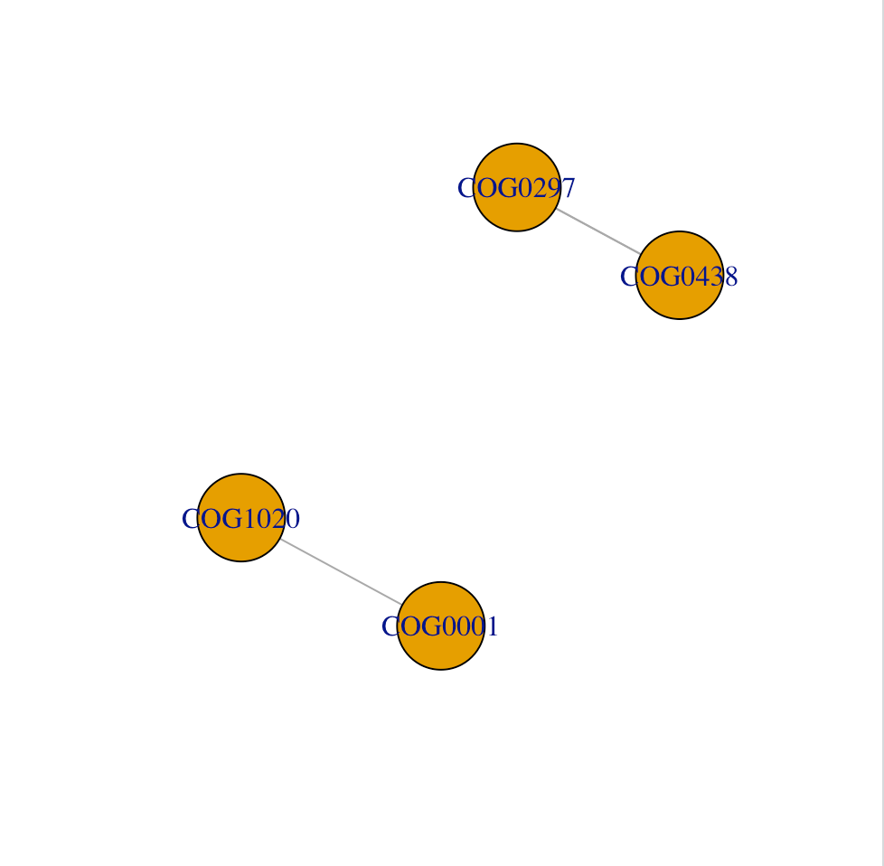

```{r setup, include=FALSE}
library(knitr)
opts_chunk$set(fig.align = "center", 
               out.width = "90%",
               fig.width = 6, fig.height = 5.5,
               dev.args=list(pointsize=10),
               par = TRUE, # needed for setting hook 
               collapse = TRUE, # collapse input & ouput code in chunks
               warning = FALSE)
knit_hooks$set(par = function(before, options, envir)
  { if(before && options$fig.show != "none") 
       par(family = "sans", mar=c(4.1,4.1,1.1,1.1), mgp=c(3,1,0), tcl=-0.5)
})
set.seed(1) # for exact reproducibility
```
       
## Introduction

`MicroMetaGraph`is an R package that, when given a set of input dataset of genes/proteins, constructs interaction networks of the present proteins or ortholog groups. This inclues performinngn queries on custom datasets, compiling evidence and graphing in a node-edge visualization. Any classification information pertaining to the dataset is printed onto the Console. The package is targeted for researchers who are interested in how proteins are grouped and interact based on functional similarity. **This document gives a tour of MicroMetaGraph (version 0.1.0)**. It was written in R Markdown, using the [knitr](https://cran.r-project.org/package=knitr) package for production. See `help(package = "MicroMetaGraph")` for further details. 

To download **MicroMetaGraph**, use the following commands:

``` r
require("devtools")
install_github("emilyso-99/MicroMetaGraph", build_vignettes = TRUE)
library("MicroMetaGraph")
```
To list all sample functions available in the package:
``` r
ls("package:MicroMetaGraph")
```

To list all sample datasets available in the package:
``` r
data(package = "MicroMetaGraph")
```

<br>

## Components

The components of the package are as follows:
<div style="text-align:left">

*GetOrthology*, when given an input vector of protein IDs from the GenBank database, uses datasets from the COG database to correctly map the proteins to their respective orthologous groups

``` r
orthologyResults <- GetOrthology(c("339670.Bamb_6476","7739.JGI124825","203124.Tery_0122"))
```
*FunctionalAnnotation*, when given an input set of orthologs, uses data from the COG database to get further information about the ortholog's functional classification

``` r
annotationResults <- FunctionalAnnotation(orthologyResults)
```

*CogLinker*, when given an input sequence of orthologs and a certain benchmark (similar to a confidence score), will calculate the interactions between orthologs that meet this benchmark derived from the STRING database.
<br>

``` r
LinkerResults <- CogLinker(orthologyResults)
```
*ProteinNetwork* and *OrthologNetwork* are two functions that actually construct the plot of the interaction network. When given an input vector of protein IDs from the Eggnog database and a chosen benchmark (for interaction scores), these two functions use the functions mentioned above to retreive the pertinent information for the network. The differences between the two is that the nodes in *ProteinNetwork* correspond to one protein while in *OrthologNetwork* they correspond to one orthlog group. Therefore, if you have several protein Eggnog IDs as your input but they all belong to the same orthologous group, *OrthologNetwork* will only produce a graph with one node.

The output is provided under the code snippet:
``` r
input <-c("339670.Bamb_6476","7739.JGI124825","203124.Tery_0122")
ProteinNetwork(input,benchmark=0)
```
<div style="text-align:center">

<div style="text-align:left">

## Package References

[So, E (2020) MicroMetaGraph: Constructing Ortholog Based Interaction Networks.
  Unpublished.](https://github.com/emilyso-99/MicroMetaGraph)

<br>

## Other References

R Core Team (2020). R: A language and environment for statistical computing. R Foundation for Statistical Computing, Vienna, Austria. https://www.R-project.org/

Wickham, H. and Bryan, J. (2019). *R Packages* (2nd edition). Newton, Massachusetts: O'Reilly Media. https://r-pkgs.org/

Tatusov RL, Galperin MY, Natale DA, Koonin EV. The COG database: a tool for genome-scale analysis of protein functions and evolution. *Nucleic Acids Res. 2000*;28(1):33-36. doi:10.1093/nar/28.1.33

Szklarczyk D, Gable AL, Lyon D, et al. STRING v11: protein-protein association networks with increased coverage, supporting functional discovery in genome-wide experimental datasets. *Nucleic Acids Res.* 2019;47(D1):D607-D613. doi:10.1093/nar/gky1131

----

```{r}
sessionInfo()
```